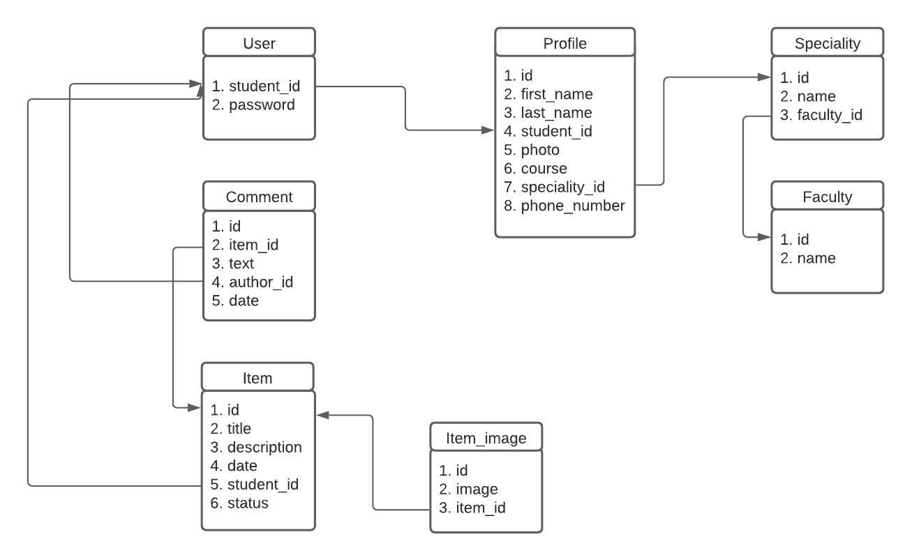
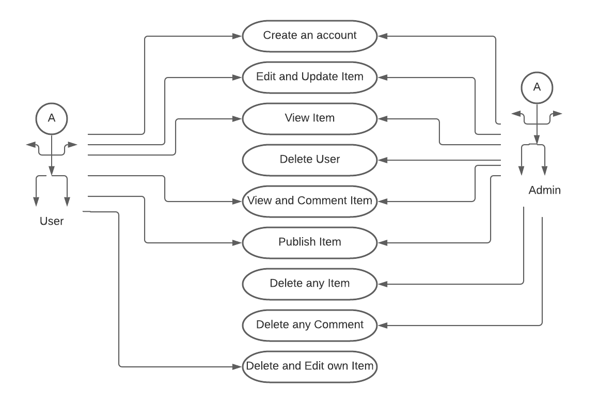

# DBMS3 project
### Team name: WEST
### Team members: 
* Darkhan Akmyrza 
* Zhangabek Maksotuly
* Yeldar Kuanyshev
### Project name: Lost and Found

### Project goal: Our WEBSITE is going to help to found losten items

### Project description: 
> Students in our university had a problem with finding losten things. So we decide to create website where students can publish their losten items and anyone who found losten items can publish to the website. 

### Programming languages:
* Python (Flask)
* Sqlite3
* HTML, CSS, JavaScript

### ER Diagram:

### Use Case Diagram:

### FAQ:
1. What is the general purpose of the project?
2. How does the user register or log in?
3. How can users see the status of lost items?
4. What kind of problem will solve our Web Project?
5. Who exactly benefits from our project?
6. How does the admin see the user's history (log)?
7. What should the user do if they find a lost item?
8. Only sdu students can use this web application?
9. If the user is unknown for the system is there a way to register him?
10. Are there any analogues of the project in other universities?
11. What privileges will admins and users have?
12. How can users publish information about lost items?
13. Can users see lost items, if they are not registered?
14. Can users delete their publications about lost items?
15. How can users reply to lost items?

### Questions of SQL queries:
1. How can users sign up to our website?
2. How can users sign in to our website?
3. How can users fill their profile information?
4. How can users post his lost items?
5. How can users add images to their posts?
6. How can users comment on other posts?
7. How can users see lost items?
8. How can users see founded items?
9. How can users delete their publication?
10. How can users update their publication?
11. How can users delete comments of their publication?
12. How can admins add new faculty?
13. How can admins add new speciality?
14. How can admins delete user's publications?
15. How can admins  delete comments of users from publications?

